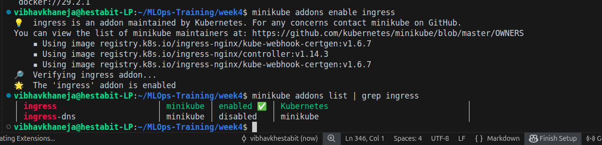
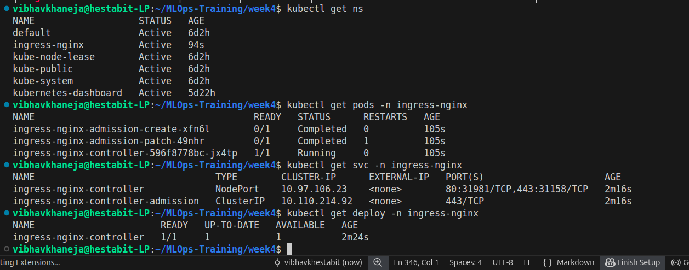
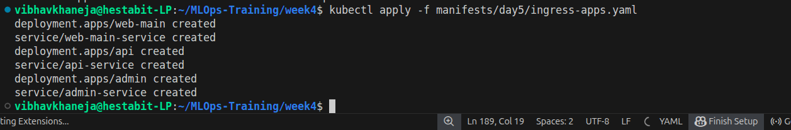
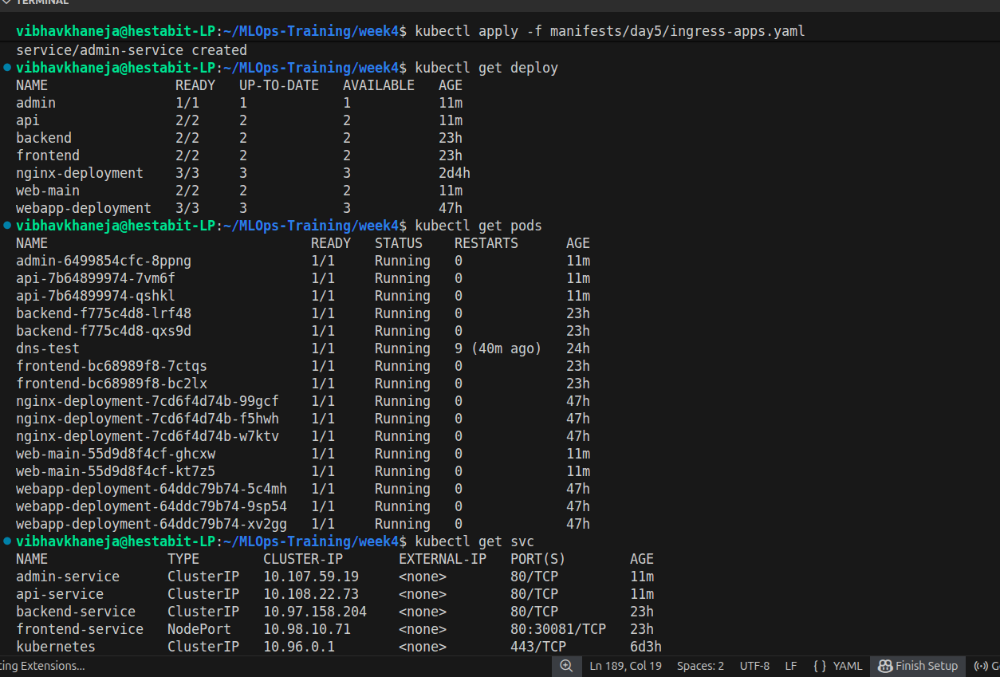
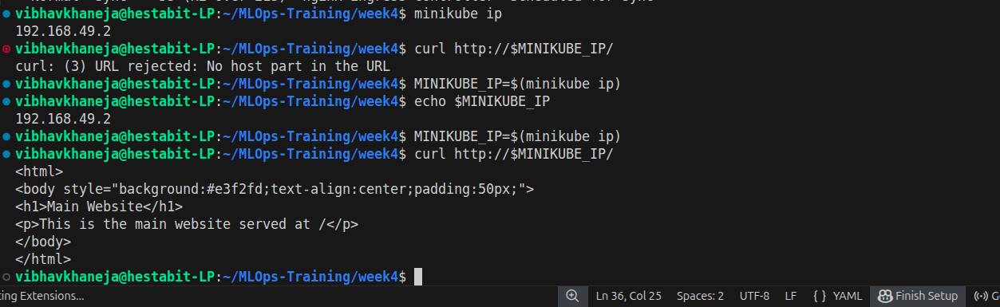
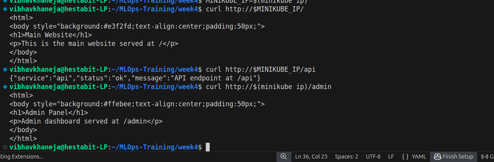
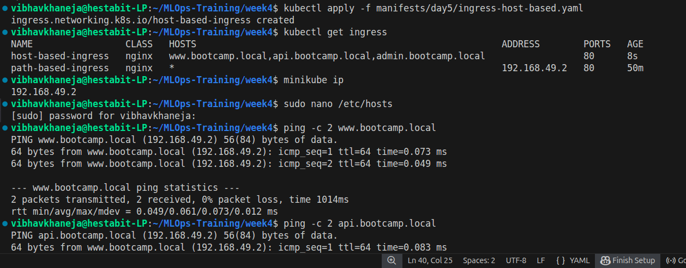
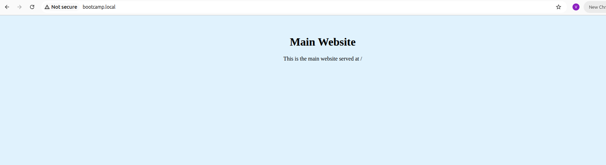
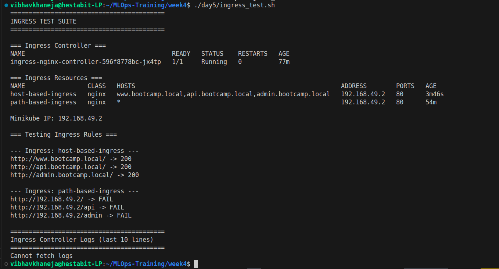
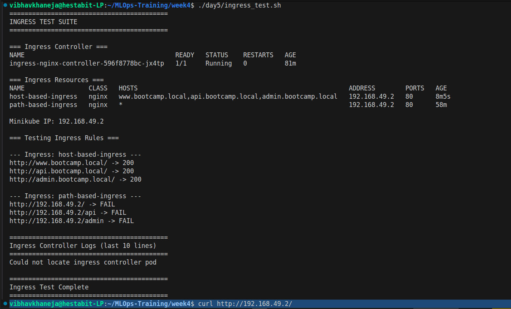

# DAY 5 — Kubernetes Ingress & Traffic Routing

## Learning Outcomes

By the end of Day 5, I was able to:

* Understand the purpose of Kubernetes Ingress.
* Differentiate between Services and Ingress.
* Deploy and configure the NGINX Ingress Controller.
* Implement path-based routing.
* Implement host-based routing.
* Route traffic to multiple backend services through a single entry point.
* Verify and troubleshoot Ingress configurations.
* Build an automated Ingress validation script.

---

# What is Ingress?

A Kubernetes Service exposes an application within or outside the cluster.

However, when multiple applications need to be exposed, creating a separate LoadBalancer or NodePort for every application becomes difficult to manage.

Ingress provides:

* Centralized traffic routing
* URL-based routing
* Hostname-based routing
* SSL/TLS termination
* Reverse proxy functionality

Instead of exposing every service individually, users access a single Ingress endpoint and traffic is routed according to defined rules.

---

# Ingress Architecture

## Without Ingress

Client
|
├── Service A
├── Service B
└── Service C

Each service requires its own exposure mechanism.

---

## With Ingress

Client
|
Ingress Controller
|
├── Web Application
├── API Service
└── Admin Service

A single entry point handles routing for all applications.

---

# Core Components

## Ingress Controller

The Ingress Controller is the actual reverse proxy running inside the cluster.

Examples:

* NGINX Ingress Controller
* Traefik
* HAProxy
* Kong

For this lab, the NGINX Ingress Controller was used.

---

## Ingress Resource

An Ingress Resource contains routing rules that define:

* Which host should be matched
* Which path should be matched
* Which backend service should receive traffic

The Ingress Resource itself does not process traffic.

Traffic processing is performed by the Ingress Controller.

---

# Exercise 1 — Enable Ingress Controller

The Minikube NGINX Ingress addon was enabled.

Tasks completed:

* Enabled ingress addon
* Verified ingress namespace
* Verified controller deployment
* Verified controller services
* Verified ingress API resources

Validation:

* ingress-nginx namespace created
* ingress-nginx-controller pod running
* ingress resources available

---

# Exercise 2 — Deploy Applications

Three applications were deployed:

## Main Website

Deployment:

* web-main

Service:

* web-main-service

Purpose:

* Serves website content

---

## API Service

Deployment:

* api

Service:

* api-service

Purpose:

* Simulates API endpoint

---

## Admin Service

Deployment:

* admin

Service:

* admin-service

Purpose:

* Simulates administration dashboard

---

# Exercise 3 — Path-Based Routing

Ingress Resource:

* path-based-ingress

Routing Configuration:

/ → web-main-service

/api → api-service

/admin → admin-service

Examples:

http://MINIKUBE_IP/

http://MINIKUBE_IP/api

http://MINIKUBE_IP/admin

Result:

A single IP address successfully routed traffic to three different backend services.

---

# Exercise 4 — Host-Based Routing

Ingress Resource:

* host-based-ingress

Routing Configuration:

[www.bootcamp.local](http://www.bootcamp.local) → web-main-service

api.bootcamp.local → api-service

admin.bootcamp.local → admin-service

Hosts file entries:

MINIKUBE_IP [www.bootcamp.local](http://www.bootcamp.local)

MINIKUBE_IP api.bootcamp.local

MINIKUBE_IP admin.bootcamp.local

Result:

Traffic was routed based on hostname rather than URL path.

---

# Exercise 5 — Ingress Testing Script

A validation script was created:

ingress_test.sh

Responsibilities:

* Verify ingress controller status
* Verify ingress resources
* Test routing rules
* Display ingress configuration
* Assist troubleshooting

Benefits:

* Faster validation
* Repeatable testing
* Simplified troubleshooting

---

# Resources Created

Deployments:

* web-main
* api
* admin

Services:

* web-main-service
* api-service
* admin-service

Ingress Resources:

* path-based-ingress
* host-based-ingress

Ingress Controller:

* ingress-nginx-controller

---

# Verification Commands

Verify deployments:

kubectl get deploy

Verify services:

kubectl get svc

Verify ingress:

kubectl get ingress

Describe ingress:

kubectl describe ingress

Check ingress controller:

kubectl get pods -n ingress-nginx

---

# Troubleshooting

## Ingress Controller Not Running

kubectl get pods -n ingress-nginx

kubectl logs -n ingress-nginx POD_NAME

---

## Ingress Not Created

kubectl describe ingress

kubectl get ingress

---

## Service Not Reachable

kubectl get svc

kubectl describe svc SERVICE_NAME

---

## Backend Pods Not Running

kubectl get pods

kubectl describe pod POD_NAME

---

# Screenshots

Store screenshots in:

screenshots/

Recommended screenshots:

---

# Key Learnings

* Ingress acts as a Layer 7 HTTP/HTTPS router.
* Ingress reduces the need for multiple NodePort or LoadBalancer services.
* Path-based routing directs traffic using URL paths.
* Host-based routing directs traffic using domain names.
* The Ingress Controller performs the actual traffic processing.
* Kubernetes Ingress is commonly used in production environments to expose multiple applications through a single endpoint.
