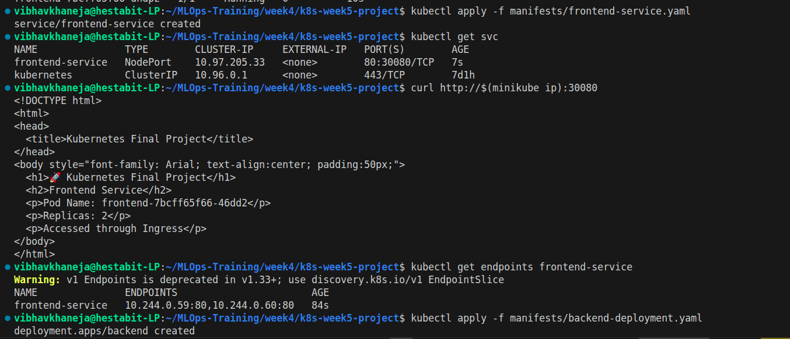
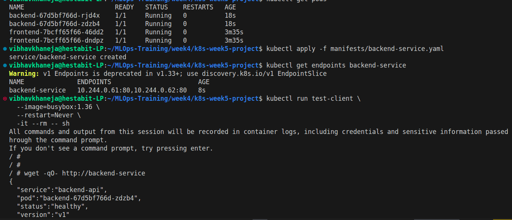
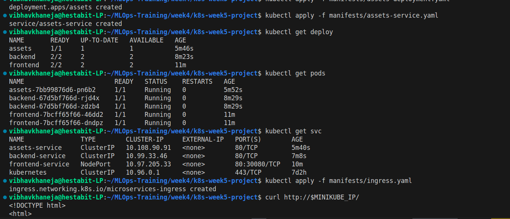
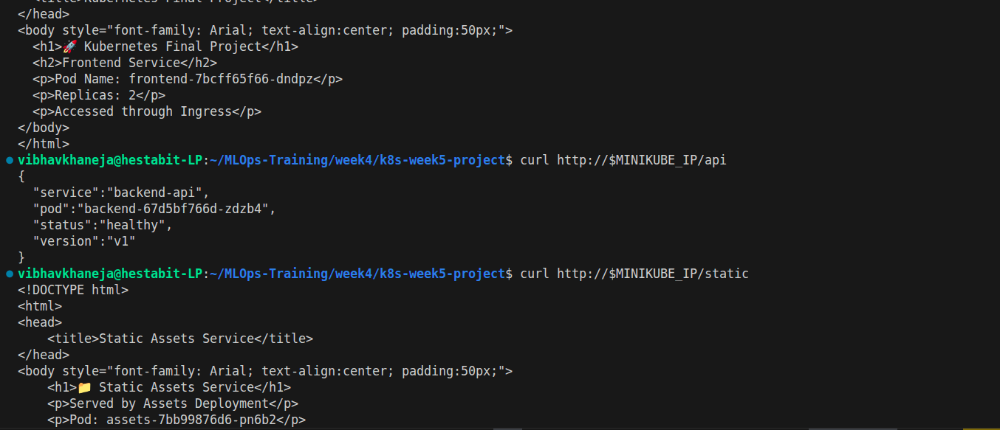
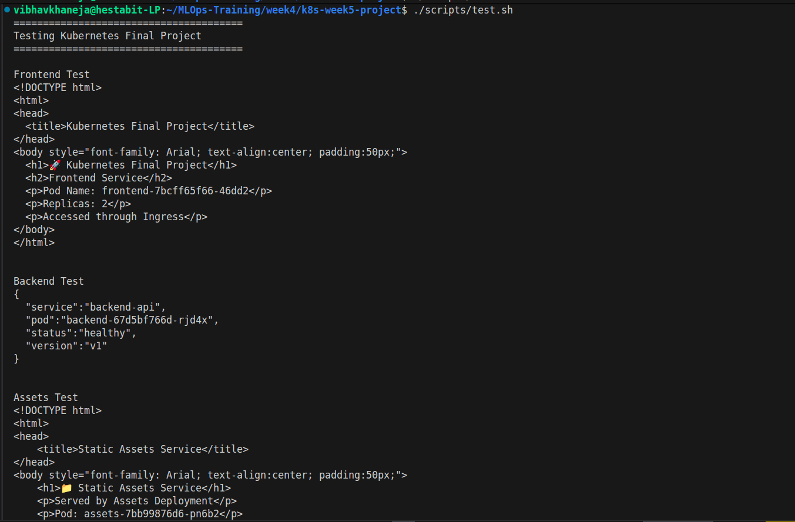
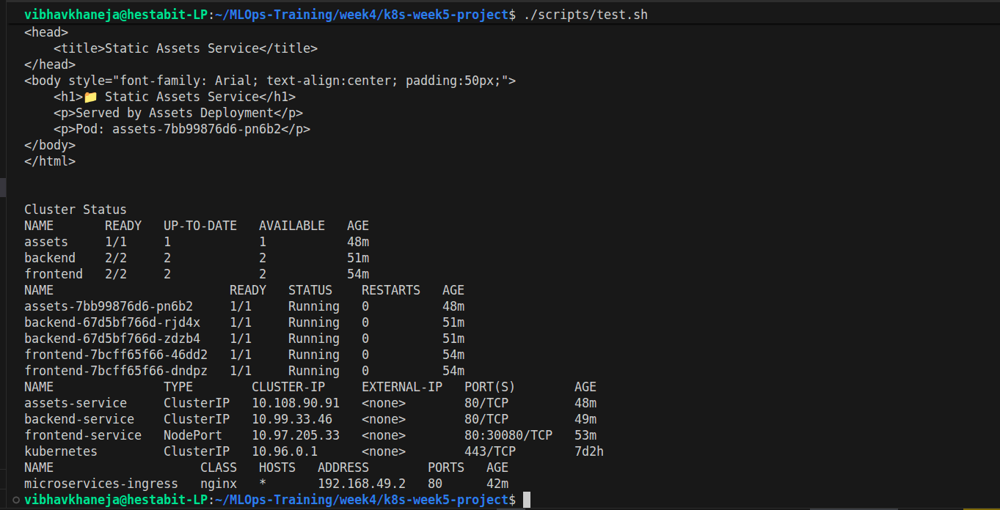

# Kubernetes Week 4 Final Project

## Microservices Demo with Services and Ingress

---

# Project Overview

This project demonstrates the deployment and management of a microservices-based application on Kubernetes using Minikube.

The objective is to consolidate all major concepts learned throughout Week 4 of the DevOps Launchpad Bootcamp into a single practical implementation.

The application consists of three independent services deployed inside a Kubernetes cluster and exposed through an NGINX Ingress Controller.

The project showcases:

* Kubernetes Pods
* Deployments and ReplicaSets
* Service Discovery
* Internal Networking
* NodePort Services
* ClusterIP Services
* Ingress Routing
* Init Containers
* Volumes
* Readiness Probes
* Liveness Probes
* Resource Requests and Limits
* Scaling and High Availability

---

# Project Architecture

```text
                         Ingress
                            |
        ------------------------------------------------
        |                      |                      |
        /                    /api                 /static
        |                      |                      |
 frontend-service       backend-service       assets-service
   NodePort              ClusterIP             ClusterIP
        |                      |                      |
   2 Frontend Pods       2 Backend Pods        1 Assets Pod
```

---

# Components

## 1. Frontend Service

The frontend service represents the user-facing application.

### Features

* NGINX-based web server
* 2 replicas for high availability
* NodePort service for direct access
* Readiness probe
* Liveness probe
* Resource requests and limits
* Custom HTML page generated using Init Container

### Kubernetes Concepts Demonstrated

* Deployment
* ReplicaSet
* Service
* Resource Management
* Health Checks
* Init Containers
* Volumes

---

## 2. Backend API Service

The backend service simulates an internal API.

### Features

* NGINX-based API endpoint
* 2 replicas
* ClusterIP service
* Internal communication only
* JSON response

### Sample Response

```json
{
  "service": "backend-api",
  "pod": "backend-67d5bf766d-zdzb4",
  "status": "healthy",
  "version": "v1"
}
```

### Kubernetes Concepts Demonstrated

* Internal Networking
* ClusterIP Services
* DNS Service Discovery
* High Availability

---

## 3. Assets Service

The assets service hosts static content.

### Features

* Single replica deployment
* ClusterIP service
* Static HTML content
* Internal service communication

### Kubernetes Concepts Demonstrated

* ClusterIP Services
* Static Content Hosting
* Pod-to-Service Communication

---

## 4. Ingress Controller

An NGINX Ingress Controller is used to expose multiple services through a single entry point.

### Routes

| Route   | Destination      |
| ------- | ---------------- |
| /       | frontend-service |
| /api    | backend-service  |
| /static | assets-service   |

### Benefits

* Single access point
* Path-based routing
* Simplified external access
* Production-style architecture

---

# Folder Structure

```text
k8s-week5-project/
│
├── manifests/
│   ├── frontend-deployment.yaml
│   ├── frontend-service.yaml
│   ├── backend-deployment.yaml
│   ├── backend-service.yaml
│   ├── assets-deployment.yaml
│   ├── assets-service.yaml
│   └── ingress.yaml
│
├── scripts/
│   ├── deploy.sh
│   ├── test.sh
│   └── cleanup.sh
│
├── README.md
└── commands.md
```

---

# Deployment Workflow

## Step 1: Start Minikube

```bash
minikube start
```

Verify cluster:

```bash
kubectl get nodes
```

Expected:

```text
NAME       STATUS   ROLES           AGE
minikube   Ready    control-plane
```

---

## Step 2: Deploy Application

Run:

```bash
./scripts/deploy.sh
```

The script deploys:

* Frontend Deployment
* Frontend Service
* Backend Deployment
* Backend Service
* Assets Deployment
* Assets Service
* Ingress Resource

---

## Step 3: Verify Deployment

### Deployments

```bash
kubectl get deploy
```

Expected:

```text
NAME       READY
frontend   2/2
backend    2/2
assets     1/1
```

### Pods

```bash
kubectl get pods
```

Expected:

```text
frontend-xxxxx
frontend-yyyyy

backend-xxxxx
backend-yyyyy

assets-xxxxx
```

### Services

```bash
kubectl get svc
```

Expected:

```text
frontend-service
backend-service
assets-service
```

### Ingress

```bash
kubectl get ingress
```

Expected:

```text
microservices-ingress
```

---

# Application Testing

## Frontend

```bash
curl http://$(minikube ip)/
```

Expected Output:

```html
🚀 Kubernetes Final Project
Frontend Service
```

---

## Backend API

```bash
curl http://$(minikube ip)/api
```

Expected Output:

```json
{
  "service":"backend-api",
  "status":"healthy"
}
```

---

## Assets Service

```bash
curl http://$(minikube ip)/static
```

Expected Output:

```html
📁 Static Assets Service
```

---

# Scaling Demonstration

Frontend can be scaled dynamically.

Scale to 4 replicas:

```bash
kubectl scale deployment frontend --replicas=4
```

Verify:

```bash
kubectl get deploy
```

Scale back:

```bash
kubectl scale deployment frontend --replicas=2
```

---

# Health Checks

## Readiness Probe

Purpose:

* Determines when a pod is ready to receive traffic.
* Prevents traffic from being sent to unready containers.

Implemented in:

* Frontend
* Backend
* Assets

---

## Liveness Probe

Purpose:

* Detects unhealthy containers.
* Automatically restarts failed containers.

Implemented in:

* Frontend
* Backend
* Assets

---

# Resource Management

Each deployment defines:

### Requests

Minimum resources guaranteed by Kubernetes.

Example:

```yaml
requests:
  cpu: "100m"
  memory: "64Mi"
```

### Limits

Maximum resources allowed.

Example:

```yaml
limits:
  cpu: "200m"
  memory: "128Mi"
```

Benefits:

* Prevents resource starvation
* Improves cluster stability
* Enables efficient scheduling

---

# Learning Outcomes

This project demonstrates practical understanding of:

## Day 1

* Kubernetes Architecture
* Minikube
* kubectl

## Day 2

* Pods
* Multi-Container Concepts
* Init Containers
* Volumes
* Health Checks

## Day 3

* Deployments
* ReplicaSets
* Scaling
* Rolling Updates

## Day 4

* Services
* ClusterIP
* NodePort
* DNS Discovery

## Day 5

* Ingress Controller
* Path-Based Routing
* External Access Management

---

# Cleanup

Remove all project resources:

```bash
./scripts/cleanup.sh
```

Verify cleanup:

```bash
kubectl get all
```

Expected:

```text
No resources found
```

---

# Screenshots








# Conclusion

This project successfully implements a Kubernetes-based microservices architecture using Deployments, Services, Ingress, Health Checks, Resource Management, and Scaling techniques.

The implementation consolidates all major Kubernetes concepts covered during Week 4 and provides a production-style deployment workflow suitable for learning, demonstrations, and future extensions.
